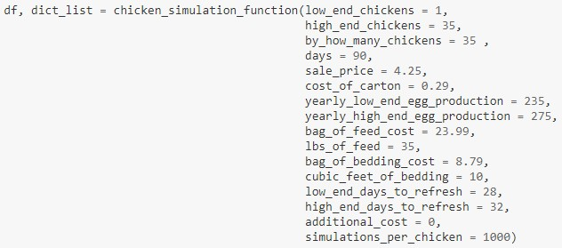
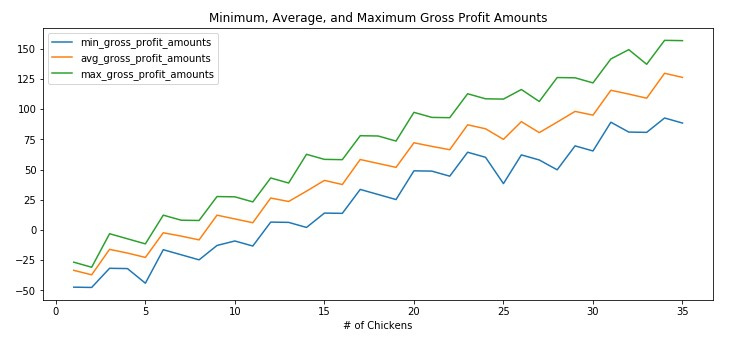
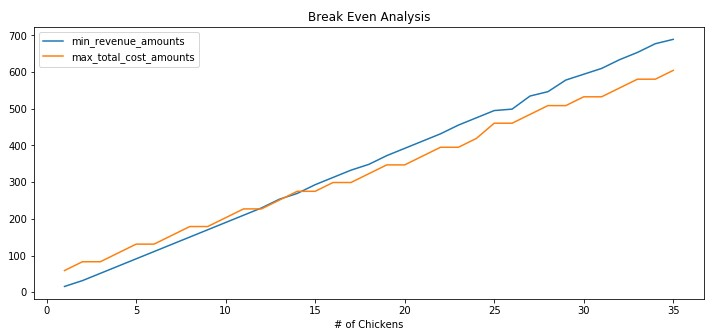
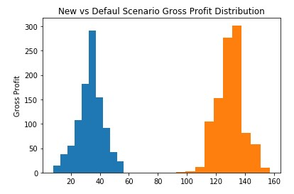
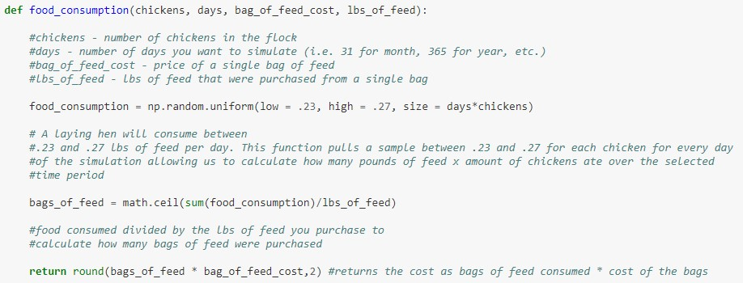

```{r setup, include=FALSE}
knitr::opts_chunk$set(echo = TRUE)
```

## The Purpose 🐔

Over the past decade, the desire for *all natural*, *fresh*, and *organic* food has grown exponentially. Significantly more offerings at grocery stores as well as the abundance of farmer's markets has made access to these foods easier and cheaper. Additionally, more consumers want to know where their food comes from, and where animals are concerned, how they are cared for. As the demand for this type of food increases, many people have wondered about getting into the game themselves, either by growing their own organic produce and selling excess or raising some type of livestock that could be sold down the road. One of the easiest areas to break into is raising laying hens to sell organic eggs. Chickens are fairly cheap to care for and require minimal maintenance. Additionally, you don't need five acres to get a couple chickens. You can maintain up to 50 chickens on a single acre. Many people just have a few chickens in their backyard. Before jumping in, many people wonder if they would be able to break even or turn a profit. There are quite a few variables to account for, so just trying to do the math on the back of a napkin often leads to over confident calculations (for example, naturally raised chickens don't lay an egg *every day*).

One of the biggest questions people ask is "How many chickens should I have?". The answer to this question is not as straightforward as you would think. While revenue from selling eggs by the dozen is linear, costs associated with chickens generally more closely resemble stairs, where costs are fairly even to a point and then double. For example, 10 chickens may be fine with one 35lb bag of feed for a month, but the 11th chicken may require you to buy a second bag, essentially doubling your cost on a cash basis for the month. Issues like these are common, which is where I'm hoping my final project can help.

## Simulation ⚙️

In the summer of 2020, I took a simulation and modeling class and [created a model](https://github.com/christianthieme/DATA604-Simulations-and-Modeling/blob/master/Week%207%20-%20Final%20Project/Final%20Project%20-%20Organic%20Egg%20Sales%20Simulation.ipynb) that, given a set of inputs (range of chickens you could have, high end and low end of egg production for the breed of chickens, sale price of a dozen eggs, cost of feed, cost of bedding, etc.), could spin through thousands of scenarios to allow for analysis of the right number of chickens to own to break even or even have a profit when selling organic eggs. This function will give you a feel for the different parameters the model can consider:

{width="522"}

This project was completed in a jupyter notebook, which didn't allow for interactivity. I simply showed how the model could work in a given situation. I want to take this project and build a front end for it using [Streamlit](https://streamlit.io/). This will allow the user to open the app and adjust the parameters of the model and then to see how each adjustment affects their gross profit and break even.

{width="415"}

{width="415"}

Additionally, because I made the model to be pretty flexible, it allows for different scenario testing as well:

{width="406"}

I'm hoping to incorporate all of the functions abilities into the app.

## The Data 💻

All of the data will be simulated based on the user input. For example, based on the number of chickens, the number of days for the simulation, the cost of a bag of feed, and the pounds of feed in the bag, I'm using probability distributions to estimate how much a chicken is eating on a given day.

{width="552"}

Using a probability distribution means the end result can vary with every run of the simulation (just like it would in real life - a chicken can eat a different amount of food on a given day). I have several functions like this for different components of the model that I churn through over a given number of scenarios. It is these turns that a user will then able to analyze to make the best decision.

## Why Streamlit ❓

Streamlit is a newer framework that has been gaining significant traction with the data science world because of how quickly you can build an app and how easily you can deploy it. Having worked through R Shiny and Dash in other projects and having deployed both of those projects, I'd love to test drive Streamlit so I can compare and see where it might fit in comparison to these other tools in my data science workflow.
